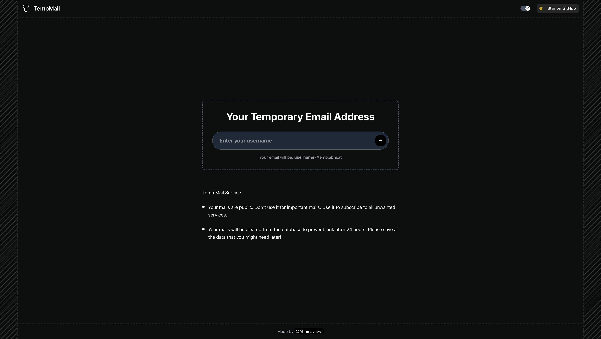

# Temp-Mail

A temporary email service with a modern UI that allows users to create disposable email addresses and receive emails without registration.



## Features

- ✨ Create custom email addresses instantly
- 📨 Receive real emails through SMTP server
- 🔄 Auto-refresh with smart polling (reduces frequency when stable)
- 🌙 Dark mode support
- 📱 Responsive design for mobile and desktop
- 🔒 Private and secure - emails auto-delete after 24 hours
- ⚡ Fast and lightweight interface


## Project Structure

The project consists of two main parts:

### Frontend

- Built with Next.js 15
- Uses React with TypeScript
- Styled with Tailwind CSS
- Located in the `/frontend` directory

### Backend

- Node.js with Express
- TypeScript
- SMTP server for receiving emails
- PostgreSQL database with Prisma ORM
- Located in the `/backend` directory

## Getting Started

### Prerequisites

- Node.js (v18+)
- PostgreSQL
- pnpm (recommended) or npm

### Backend Setup

1. Navigate to the backend directory:

```bash
cd backend
```

2. Install dependencies:

```bash
pnpm install
```

3. Set up environment variables:

Create a `.env` file in the backend directory with the following content:

```
# Database
DATABASE_URL=

# Frontend URL for CORS
FRONTEND_URL=
CORS_ORIGIN=

# Backend Configuration
API_PORT=3001
SMTP_PORT=25

# SMTP Configuration
SMTP_DOMAIN=

# Environment
NODE_ENV=production

# Rate Limiting
RATE_LIMIT_WINDOW_MS=900000
RATE_LIMIT_MAX=100
```

4. Run database migrations:

```bash
pnpm prisma migrate dev
```

5. Start the backend server:

```bash
# Development mode
pnpm dev

# Production mode
pnpm build
pnpm start
```

### Frontend Setup

1. Navigate to the frontend directory:

```bash
cd frontend
```

2. Install dependencies:

```bash
pnpm install
```

3. Set up environment variables:

Create a `.env` file in the frontend directory with the following content:

```
NEXT_PUBLIC_API_BASE=
```

4. Start the frontend development server:

```bash
# Development mode
pnpm dev

# Production mode
pnpm build
pnpm start
```

5. Open [http://localhost:3000](http://localhost:3000) in your browser to see the application.

## Backend Architecture

The backend is built with Node.js and Express, providing both an API server and an SMTP server for receiving emails.

### Key Components

- **API Server**: Handles HTTP requests for creating mailboxes and retrieving messages
- **SMTP Server**: Receives incoming emails and stores them in the database
- **Database**: PostgreSQL with Prisma ORM for data storage and retrieval
- **Rate Limiting**: Prevents abuse by limiting request frequency
- **Cleanup Service**: Automatically removes expired emails after 24 hours

### API Endpoints

- `POST /api/mailboxes/custom` - Create a custom mailbox
- `POST /api/mailboxes/:address/messages` - Get messages for a mailbox
- `GET /api/messages/:id` - Get a specific message

### Database Schema

The database uses Prisma ORM with the following main models:

- `Mailbox`: Represents a temporary email address
- `Message`: Stores received emails with their content and metadata

## Frontend Architecture

The frontend is built with Next.js 15 and React, providing a responsive and modern user interface.

### Key Components

- **Home Page**: Allows users to create custom email addresses
- **Mailbox Page**: Displays received emails with auto-refresh functionality
- **Message Detail Page**: Shows the full content of an email

### Technologies Used

- **Next.js**: React framework with App Router
- **React**: UI library for building components
- **TypeScript**: Type-safe JavaScript
- **Tailwind CSS**: Utility-first CSS framework
- **Sonner**: Toast notifications

### State Management

- React hooks for local state management
- Smart polling with exponential backoff for API requests
- Optimized refresh logic to reduce API calls

## Development

### Running Tests

```bash
# Backend tests
cd backend
pnpm test

# Frontend tests
cd frontend
pnpm test
```

### Building for Production

```bash
# Build backend
cd backend
pnpm build

# Build frontend
cd frontend
pnpm build
```

## Deployment

### Backend Deployment

The backend can be deployed to any Node.js hosting service:

1. Set up the environment variables as described above
2. Build the project: `pnpm build`
3. Start the server: `pnpm start`

### Frontend Deployment

The frontend can be deployed to Vercel or any static hosting service:

1. Set up the environment variables as described above
2. Build the project: `pnpm build`
3. Deploy the `.next` folder

## Contributing

Contributions are welcome! Please feel free to submit a Pull Request.

## License

This project is licensed under the MIT License - see the LICENSE file for details.