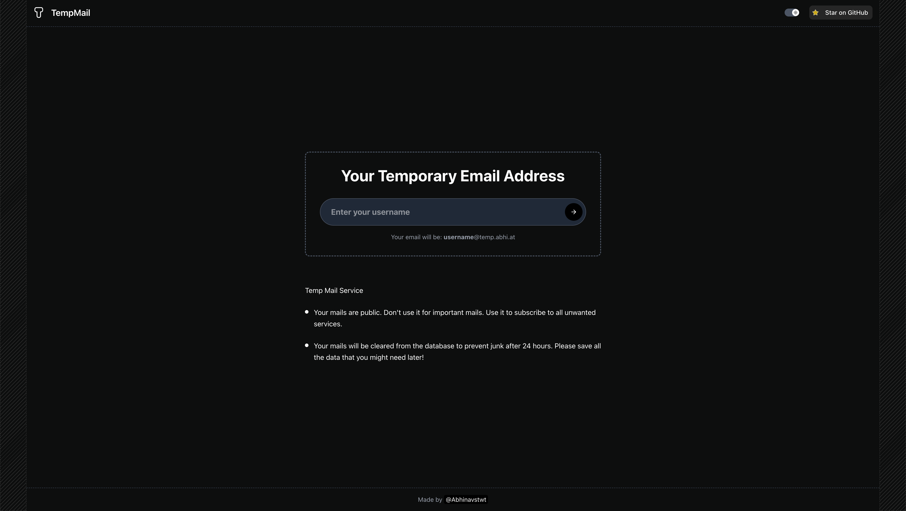

# Temp-Mail Frontend

The frontend component of the Temp-Mail service, providing a modern and responsive user interface for creating and managing temporary email addresses.




## Directory Structure

```
frontend/
├── app/                 # Next.js App Router pages
│   ├── mailbox/         # Mailbox pages
│   └── page.tsx         # Home page
├── components/          # React components
│   ├── layout/          # Layout components
│   └── ui/              # UI components
├── lib/                 # Utility functions and API client
├── public/              # Static assets
├── styles/              # Global styles
├── .env                 # Environment variables (not in git)
├── .env.example         # Example environment variables
├── next.config.js       # Next.js configuration
└── package.json         # Dependencies and scripts
```

## Prerequisites

- Node.js (v18+)
- pnpm (recommended) or npm

## Installation

1. Clone the repository and navigate to the frontend directory:

```bash
cd frontend
```

2. Install dependencies:

```bash
pnpm install
```

3. Set up environment variables:

Create a `.env` file in the frontend directory with the following content:

```
NEXT_PUBLIC_API_BASE=http://localhost:3001
```

Replace the URL with your backend API URL.

## Running the Application

### Development Mode

```bash
pnpm dev
```

This will start the development server at [http://localhost:3000](http://localhost:3000).

### Production Mode

```bash
pnpm build
pnpm start
```

## Key Components

### Pages

- **Home Page (`app/page.tsx`)**: Landing page with email address creation form
- **Mailbox Page (`app/mailbox/[username]/page.tsx`)**: Displays received emails with auto-refresh
- **Message Detail Page (`app/mailbox/[username]/message/[messageId]/page.tsx`)**: Shows the full content of an email

### Components

- **Layout Components**: Header, Footer, Border Decoration
- **UI Components**: Button, Input, Toast notifications, etc.
- **Screen Component**: Responsive container for desktop view

### API Integration

The frontend communicates with the backend API using the functions in `lib/api.ts`:

- `createCustomMailbox`: Creates a new custom mailbox
- `fetchMessages`: Gets messages for a mailbox
- `fetchMessage`: Gets a specific message

## Smart Polling and Error Handling

The application implements smart polling and error handling:

1. **Adaptive Polling**:
   - Initial polling every 10 seconds
   - Exponential backoff on errors (2^n * 2000ms, max 60s)
   - Reduced polling frequency (30s) when email count stabilizes

2. **Error Resilience**:
   - Automatic retry mechanism for transient errors
   - Cache-busting parameters to prevent stale responses
   - Graceful degradation on server errors
   - Clear error messaging with retry options

3. **Connection Management**:
   - Automatic reconnection after network issues
   - Backoff strategy for 429 (Too Many Requests) errors
   - Visual feedback during connection attempts

## Responsive Design

The application is fully responsive with specific optimizations:

1. **Mobile View**:
   - Full-width buttons for better touch targets
   - Stacked button layout for small screens
   - Centered loading indicators
   - Full page scrolling for long emails
   - Optimized padding and spacing

2. **Tablet View**:
   - Responsive transitions between mobile and desktop layouts
   - Optimized content display for medium screens

3. **Desktop View**:
   - Two-column email layout for efficient space usage
   - Horizontal button layout
   - Enhanced visual elements

## Environment Variables

| Variable | Description | Default |
|----------|-------------|---------|
| NEXT_PUBLIC_API_BASE | Backend API URL | http://localhost:3001 |

## Scripts

- `pnpm dev` - Start the development server
- `pnpm build` - Build the application for production
- `pnpm start` - Start the production server
- `pnpm lint` - Run ESLint

## Technologies

- **Next.js**: React framework with App Router
- **React**: UI library
- **TypeScript**: Type-safe JavaScript
- **Tailwind CSS**: Utility-first CSS framework
- **Sonner**: Toast notifications
- **Lucide**: Icon library
- **Next Themes**: Dark mode support

## Browser Support

The application supports all modern browsers:

- Chrome (latest)
- Firefox (latest)
- Safari (latest)
- Edge (latest)